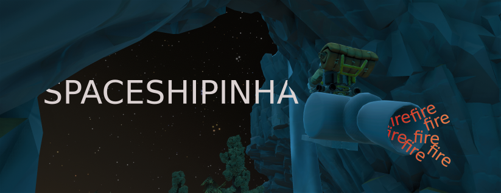

# Spaceshipinha

# 

Adds a custom ship simmilar to the one in the Outer Wilds Alpha mod [Navinha](https://github.com/ShoosGun/Navinha).

This vessel only knows one direction **foward!**. 

You have full controll of the rotations, but for translation you only have two options: change the thruster power, or turn the thruster on. 

To change the thruster power use the "go up" and "go down" inputs to increase or decrease it. 

And to turn the thruster on use the "go foward" input, be aware that it works in a binary fashion, so if you are using the controller a gentle push on the stick will make it go at full speed.
